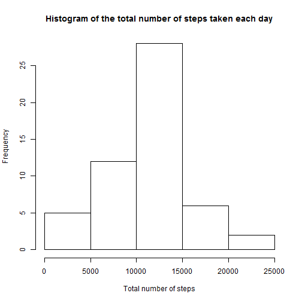
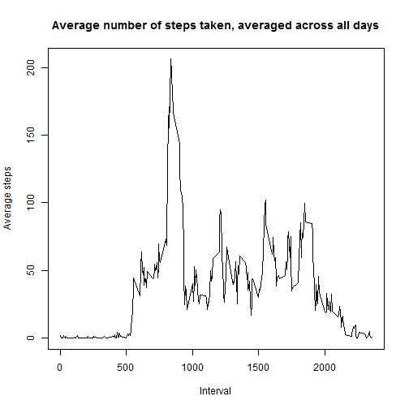
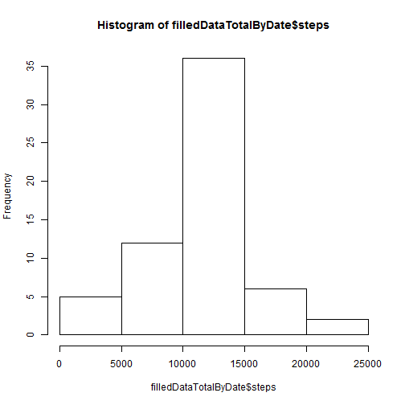
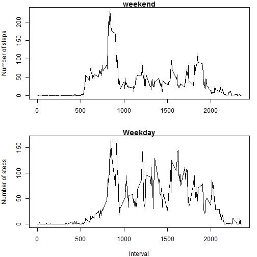

## Loading and preprocessing the data
1. Load the data from the csv
The csv can be downloaded here: https://github.com/awauthier/RepData_PeerAssessment1/blob/master/activity.zip
It must be decompressed in the working directory in order to be loaded in R via the following command:

```r
data <- read.csv("activity.csv")
```
2. Preprocess the data
No data transformation is required.

## What is mean total number of steps taken per day?
1. Histogram of the total number of steps taken each day
Calculate first the aggregated values:

```r
dataTotalByDate <- aggregate(. ~ date, data[,c("date","steps")], sum, na.rm=TRUE)
dataMeanByInterval <- aggregate(. ~ interval, data[,c("interval","steps")], mean, na.rm=TRUE)
```
The historgram of the total number of steps taken each day is as follow:

```r
hist(dataTotalByDate$steps, 
	 main="Histogram of the total number of steps taken each day",
	 xlab="Total number of steps")
```

 
2. Mean of the total number of steps taken per day

```r
mean(dataTotalByDate$steps, na.rm=TRUE)
```

```
## [1] 10766.19
```
3. Median of the total number of steps taken per day:

```r
median(dataTotalByDate$steps, na.rm=TRUE)
```

```
## [1] 10765
```

## What is the average daily activity pattern?
1. Time series plot of the 5-minutes interval and the average number of steps taken averaged across all days

```r
plot(dataMeanByInterval$interval, dataMeanByInterval$steps, type="l",
	 main="Average number of steps taken, averaged across all days",
	 xlab="Interval",
	 ylab="Average steps")
```

 
2. The 5-minute interval, on average across all the days in the dataset, that contains the maximum number of steps is:

```r
dataMeanByInterval[dataMeanByInterval$steps == max(dataMeanByInterval$steps),]
```

```
##     interval    steps
## 104      835 206.1698
```

## Imputing missing values
1. Total number of missing values in the dataset

```r
isna <- is.na(data$steps)
sum(isna)
```

```
## [1] 2304
```
2. Strategy for filling the mising values
We will replace the missing steps values by the average steps values by interval across all days.

3. New dataset with mising data filled in

```r
filledData <- data
intervals <- unique(data$interval)
missingData <- filledData[isna == TRUE,]
for (inter in intervals) {
	missingData$steps[missingData$interval==inter] <- dataMeanByInterval$step[dataMeanByInterval$interval==inter]
}
filledData$steps[isna == TRUE] <- missingData$steps
```
The dataset named "filledData"" contains the original data with the missing data filled in.

4. Histogram of the total number of steps taken each day

```r
filledDataTotalByDate <- aggregate(. ~ date, filledData[,c("date","steps")], sum, na.rm=TRUE)
hist(filledDataTotalByDate$steps)
```

 
Mean of the total number of steps taken per day:

```r
mean(filledDataTotalByDate$steps)
```

```
## [1] 10766.19
```
Median of the total number of steps taken per day:

```r
median(filledDataTotalByDate$steps)
```

```
## [1] 10766.19
```

The impact of imputing missing data on the estimates of the total daily number of steps is visible on the median only as expected. Indeed, as we filled the missing values with average values, the mean should not be impacted. But for the median value, the new values gives more weigth on the mean, leading the median to be the same as the mean.

## Are there differences in activity patterns between weekdays and weekends?
1. Add a column with the factor "weekday"/"weekend" to the dataset
Remark that we need to set the locale to "English" to avoid localisation of the day names.

```r
Sys.setlocale("LC_TIME", "English")
```

```
## [1] "English_United States.1252"
```

```r
weekdays <- lapply(weekdays(as.Date(data$date)), function(x) {if (x=="Saturday"|x=="Sunday") "weekend" else "weekday"})
filledData$weekday <- weekdays
```
The dataset named "filledData" contains a new weekday column with the required information.

2. Time series plot of the 5-minute interval and the average number of steps taken, averaged across all weekday days or weekend days

Create first the 2 data sets.

```r
dataMeanByIntervalWE <- aggregate(. ~ interval, filledData[filledData$weekday=="weekend",c("interval","steps")], mean, na.rm=TRUE)
dataMeanByIntervalWD <- aggregate(. ~ interval, filledData[filledData$weekday!="weekend",c("interval","steps")], mean, na.rm=TRUE)
```

Plots:

```r
par(mfrow=c(2, 1))
par(mar=c(4,4,1,1), oma=c(0,0,0,0))
plot(dataMeanByIntervalWD$interval, dataMeanByIntervalWD$steps, type="l",
	 main="weekend",
	 xlab="",
	 ylab="Number of steps")
plot(dataMeanByIntervalWE$interval, dataMeanByIntervalWE$steps, type="l",
	 main="Weekday",
	 xlab="Interval",
	 ylab="Number of steps")
```

 
